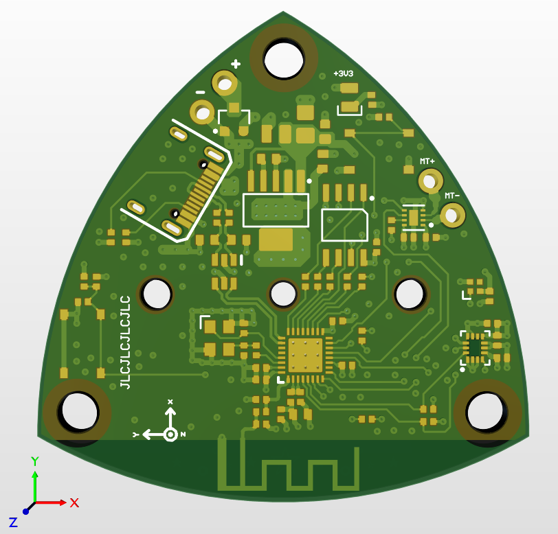

# Jirachi: self-balancing Reuleaux triangle

Jirachi is an embedded device in the shape of a Reuleaux triangle which is able to balance itself in the positions where the system is unstable. This is done through active control in the form of a PID controller.

TODO: add hardware/mechanical stuff, document code, take pretty pictures, die with positive aura