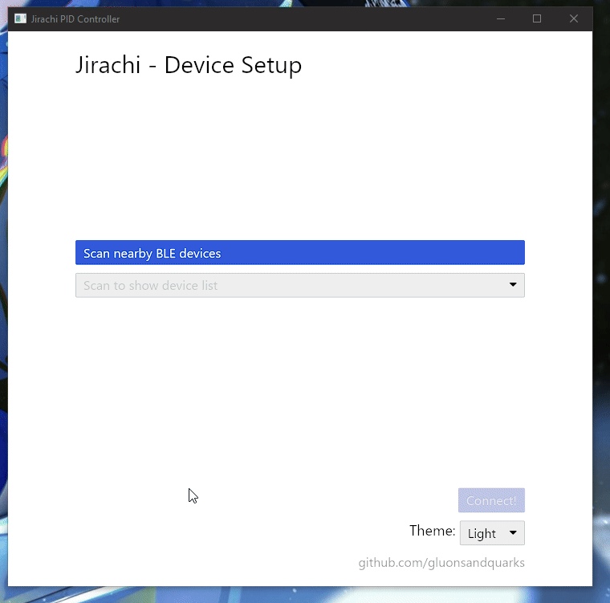

# Jirachi GUI

The Jirachi GUI is a cross-platform GUI made in Rust to control and tune the PID controller inside of the jirachi device. It is written around the [iced GUI framework](https://github.com/iced-rs/iced) and the [btleplug library](https://github.com/deviceplug/btleplug/tree/master) to easily control the jirachi device and let the GUI app handle all the BLE communication.



## Quick Start

```bash
$ cargo run --release
```

Please don't scream at me for the ugly code, there's only so much I can do with the way the framework works and honestly I'm done with refactoring cause Rust being Rust it is a pain to do rewrite some stuff...

## Dependencies

This project has the following dependencies

```
[dependencies]
btleplug = "0.11.7"
iced = "0.13.1"
uuid = "1.12.1"
```

Turns out that adding a cross-platform GUI and a cross-platform BLE library really bloat your application lmfao but it is what it is and I just wanted a way to circumvent the fact that I needed to define some particular BLE characteristics on my BLE peripheral to be able to connect it and pair it natively to Windows (cause Windows sucks!!!!). You can read more about this issue [over here](https://github.com/espressif/esp-idf/issues/10653#issuecomment-1751914245), a lot of these characteristics weren't needed by my device and honestly is just bloat. Sure I could've implemented them in about 30 mins but where's the fun in that? Instead I spent ~a week developing a GUI that let's me get away with this :P

A side effect of this is that the dependency tree is now fucked lol. oh well, you win some you lose some :)

```{toggle}
$ cargo tree
gui v0.1.0 (C:\Users\Usuario\Repos\jirachi\gui)
├── btleplug v0.11.7
│   ├── async-trait v0.1.85 (proc-macro)
│   │   ├── proc-macro2 v1.0.93
│   │   │   └── unicode-ident v1.0.14
│   │   ├── quote v1.0.38
│   │   │   └── proc-macro2 v1.0.93 (*)
│   │   └── syn v2.0.96
│   │       ├── proc-macro2 v1.0.93 (*)
│   │       ├── quote v1.0.38 (*)
│   │       └── unicode-ident v1.0.14
│   ├── bitflags v2.7.0
│   ├── dashmap v6.1.0
│   │   ├── cfg-if v1.0.0
│   │   ├── crossbeam-utils v0.8.21
│   │   ├── hashbrown v0.14.5
│   │   │   ├── ahash v0.8.11
│   │   │   │   ├── cfg-if v1.0.0
│   │   │   │   ├── once_cell v1.20.2
│   │   │   │   └── zerocopy v0.7.35
│   │   │   │   [build-dependencies]
│   │   │   │   └── version_check v0.9.5
│   │   │   └── allocator-api2 v0.2.21
│   │   ├── lock_api v0.4.12
│   │   │   └── scopeguard v1.2.0
│   │   │   [build-dependencies]
│   │   │   └── autocfg v1.4.0
│   │   ├── once_cell v1.20.2
│   │   └── parking_lot_core v0.9.10
│   │       ├── cfg-if v1.0.0
│   │       ├── smallvec v1.13.2
│   │       └── windows-targets v0.52.6
│   │           └── windows_x86_64_msvc v0.52.6
│   ├── futures v0.3.31
│   │   ├── futures-channel v0.3.31
│   │   │   ├── futures-core v0.3.31
│   │   │   └── futures-sink v0.3.31
│   │   ├── futures-core v0.3.31
│   │   ├── futures-executor v0.3.31
│   │   │   ├── futures-core v0.3.31
│   │   │   ├── futures-task v0.3.31
│   │   │   ├── futures-util v0.3.31
│   │   │   │   ├── futures-channel v0.3.31 (*)
│   │   │   │   ├── futures-core v0.3.31
│   │   │   │   ├── futures-io v0.3.31
│   │   │   │   ├── futures-macro v0.3.31 (proc-macro)
│   │   │   │   │   ├── proc-macro2 v1.0.93 (*)
│   │   │   │   │   ├── quote v1.0.38 (*)
│   │   │   │   │   └── syn v2.0.96 (*)
│   │   │   │   ├── futures-sink v0.3.31
│   │   │   │   ├── futures-task v0.3.31
│   │   │   │   ├── memchr v2.7.4
│   │   │   │   ├── pin-project-lite v0.2.16
│   │   │   │   ├── pin-utils v0.1.0
│   │   │   │   └── slab v0.4.9
│   │   │   │       [build-dependencies]
│   │   │   │       └── autocfg v1.4.0
│   │   │   └── num_cpus v1.16.0
│   │   ├── futures-io v0.3.31
│   │   ├── futures-sink v0.3.31
│   │   ├── futures-task v0.3.31
│   │   └── futures-util v0.3.31 (*)
│   ├── log v0.4.25
│   ├── static_assertions v1.1.0
│   ├── thiserror v2.0.11
│   │   └── thiserror-impl v2.0.11 (proc-macro)
│   │       ├── proc-macro2 v1.0.93 (*)
│   │       ├── quote v1.0.38 (*)
│   │       └── syn v2.0.96 (*)
│   ├── tokio v1.43.0
│   │   └── pin-project-lite v0.2.16
│   ├── tokio-stream v0.1.17
│   │   ├── futures-core v0.3.31
│   │   ├── pin-project-lite v0.2.16
│   │   ├── tokio v1.43.0 (*)
│   │   └── tokio-util v0.7.13
│   │       ├── bytes v1.9.0
│   │       ├── futures-core v0.3.31
│   │       ├── futures-sink v0.3.31
│   │       ├── pin-project-lite v0.2.16
│   │       └── tokio v1.43.0 (*)
│   ├── uuid v1.12.1
│   └── windows v0.57.0
│       ├── windows-core v0.57.0
│       │   ├── windows-implement v0.57.0 (proc-macro)
│       │   │   ├── proc-macro2 v1.0.93 (*)
│       │   │   ├── quote v1.0.38 (*)
│       │   │   └── syn v2.0.96 (*)
│       │   ├── windows-interface v0.57.0 (proc-macro)
│       │   │   ├── proc-macro2 v1.0.93 (*)
│       │   │   ├── quote v1.0.38 (*)
│       │   │   └── syn v2.0.96 (*)
│       │   ├── windows-result v0.1.2
│       │   │   └── windows-targets v0.52.6 (*)
│       │   └── windows-targets v0.52.6 (*)
│       └── windows-targets v0.52.6 (*)
├── iced v0.13.1
│   ├── iced_core v0.13.2
│   │   ├── bitflags v2.7.0
│   │   ├── bytes v1.9.0
│   │   ├── dark-light v1.1.1
│   │   │   └── winreg v0.10.1
│   │   │       └── winapi v0.3.9
│   │   ├── glam v0.25.0
│   │   ├── log v0.4.25
│   │   ├── num-traits v0.2.19
│   │   │   [build-dependencies]
│   │   │   └── autocfg v1.4.0
│   │   ├── once_cell v1.20.2
│   │   ├── palette v0.7.6
│   │   │   ├── approx v0.5.1
│   │   │   │   └── num-traits v0.2.19 (*)
│   │   │   ├── fast-srgb8 v1.0.0
│   │   │   ├── palette_derive v0.7.6 (proc-macro)
│   │   │   │   ├── by_address v1.2.1
│   │   │   │   ├── proc-macro2 v1.0.93 (*)
│   │   │   │   ├── quote v1.0.38 (*)
│   │   │   │   └── syn v2.0.96 (*)
│   │   │   └── phf v0.11.3
│   │   │       ├── phf_macros v0.11.3 (proc-macro)
│   │   │       │   ├── phf_generator v0.11.3
│   │   │       │   │   ├── phf_shared v0.11.3
│   │   │       │   │   │   └── siphasher v1.0.1
│   │   │       │   │   └── rand v0.8.5
│   │   │       │   │       └── rand_core v0.6.4
│   │   │       │   ├── phf_shared v0.11.3 (*)
│   │   │       │   ├── proc-macro2 v1.0.93 (*)
│   │   │       │   ├── quote v1.0.38 (*)
│   │   │       │   └── syn v2.0.96 (*)
│   │   │       └── phf_shared v0.11.3 (*)
│   │   ├── rustc-hash v2.1.0
│   │   ├── smol_str v0.2.2
│   │   ├── thiserror v1.0.69
│   │   │   └── thiserror-impl v1.0.69 (proc-macro)
│   │   │       ├── proc-macro2 v1.0.93 (*)
│   │   │       ├── quote v1.0.38 (*)
│   │   │       └── syn v2.0.96 (*)
│   │   └── web-time v1.1.0
│   ├── iced_futures v0.13.2
│   │   ├── futures v0.3.31 (*)
│   │   ├── iced_core v0.13.2 (*)
│   │   ├── log v0.4.25
│   │   └── rustc-hash v2.1.0
│   ├── iced_renderer v0.13.0
│   │   ├── iced_graphics v0.13.0
│   │   │   ├── bitflags v2.7.0
│   │   │   ├── bytemuck v1.21.0
│   │   │   │   └── bytemuck_derive v1.8.1 (proc-macro)
│   │   │   │       ├── proc-macro2 v1.0.93 (*)
│   │   │   │       ├── quote v1.0.38 (*)
│   │   │   │       └── syn v2.0.96 (*)
│   │   │   ├── cosmic-text v0.12.1
│   │   │   │   ├── bitflags v2.7.0
│   │   │   │   ├── fontdb v0.16.2
│   │   │   │   │   ├── log v0.4.25
│   │   │   │   │   ├── memmap2 v0.9.5
│   │   │   │   │   ├── slotmap v1.0.7
│   │   │   │   │   │   [build-dependencies]
│   │   │   │   │   │   └── version_check v0.9.5
│   │   │   │   │   ├── tinyvec v1.8.1
│   │   │   │   │   │   └── tinyvec_macros v0.1.1
│   │   │   │   │   └── ttf-parser v0.20.0
│   │   │   │   ├── log v0.4.25
│   │   │   │   ├── rangemap v1.5.1
│   │   │   │   ├── rayon v1.10.0
│   │   │   │   │   ├── either v1.13.0
│   │   │   │   │   └── rayon-core v1.12.1
│   │   │   │   │       ├── crossbeam-deque v0.8.6
│   │   │   │   │       │   ├── crossbeam-epoch v0.9.18
│   │   │   │   │       │   │   └── crossbeam-utils v0.8.21
│   │   │   │   │       │   └── crossbeam-utils v0.8.21
│   │   │   │   │       └── crossbeam-utils v0.8.21
│   │   │   │   ├── rustc-hash v1.1.0
│   │   │   │   ├── rustybuzz v0.14.1
│   │   │   │   │   ├── bitflags v2.7.0
│   │   │   │   │   ├── bytemuck v1.21.0 (*)
│   │   │   │   │   ├── libm v0.2.11
│   │   │   │   │   ├── smallvec v1.13.2
│   │   │   │   │   ├── ttf-parser v0.21.1
│   │   │   │   │   ├── unicode-bidi-mirroring v0.2.0
│   │   │   │   │   ├── unicode-ccc v0.2.0
│   │   │   │   │   ├── unicode-properties v0.1.3
│   │   │   │   │   └── unicode-script v0.5.7
│   │   │   │   ├── self_cell v1.1.0
│   │   │   │   ├── swash v0.1.19
│   │   │   │   │   ├── skrifa v0.22.3
│   │   │   │   │   │   ├── bytemuck v1.21.0 (*)
│   │   │   │   │   │   └── read-fonts v0.22.7
│   │   │   │   │   │       ├── bytemuck v1.21.0 (*)
│   │   │   │   │   │       └── font-types v0.7.3
│   │   │   │   │   │           └── bytemuck v1.21.0 (*)
│   │   │   │   │   ├── yazi v0.1.6
│   │   │   │   │   └── zeno v0.2.3
│   │   │   │   ├── sys-locale v0.3.2
│   │   │   │   ├── ttf-parser v0.21.1
│   │   │   │   ├── unicode-bidi v0.3.18
│   │   │   │   ├── unicode-linebreak v0.1.5
│   │   │   │   ├── unicode-script v0.5.7
│   │   │   │   └── unicode-segmentation v1.12.0
│   │   │   ├── half v2.4.1
│   │   │   │   └── cfg-if v1.0.0
│   │   │   ├── iced_core v0.13.2 (*)
│   │   │   ├── iced_futures v0.13.2 (*)
│   │   │   ├── log v0.4.25
│   │   │   ├── once_cell v1.20.2
│   │   │   ├── raw-window-handle v0.6.2
│   │   │   ├── rustc-hash v2.1.0
│   │   │   ├── thiserror v1.0.69 (*)
│   │   │   └── unicode-segmentation v1.12.0
│   │   ├── iced_tiny_skia v0.13.0
│   │   │   ├── bytemuck v1.21.0 (*)
│   │   │   ├── cosmic-text v0.12.1 (*)
│   │   │   ├── iced_graphics v0.13.0 (*)
│   │   │   ├── kurbo v0.10.4
│   │   │   │   ├── arrayvec v0.7.6
│   │   │   │   └── smallvec v1.13.2
│   │   │   ├── log v0.4.25
│   │   │   ├── rustc-hash v2.1.0
│   │   │   ├── softbuffer v0.4.6
│   │   │   │   ├── log v0.4.25
│   │   │   │   ├── raw-window-handle v0.6.2
│   │   │   │   └── windows-sys v0.59.0
│   │   │   │       └── windows-targets v0.52.6 (*)
│   │   │   │   [build-dependencies]
│   │   │   │   └── cfg_aliases v0.2.1
│   │   │   └── tiny-skia v0.11.4
│   │   │       ├── arrayref v0.3.9
│   │   │       ├── arrayvec v0.7.6
│   │   │       ├── bytemuck v1.21.0 (*)
│   │   │       ├── cfg-if v1.0.0
│   │   │       ├── log v0.4.25
│   │   │       ├── png v0.17.16
│   │   │       │   ├── bitflags v1.3.2
│   │   │       │   ├── crc32fast v1.4.2
│   │   │       │   │   └── cfg-if v1.0.0
│   │   │       │   ├── fdeflate v0.3.7
│   │   │       │   │   └── simd-adler32 v0.3.7
│   │   │       │   ├── flate2 v1.0.35
│   │   │       │   │   ├── crc32fast v1.4.2 (*)
│   │   │       │   │   └── miniz_oxide v0.8.3
│   │   │       │   │       ├── adler2 v2.0.0
│   │   │       │   │       └── simd-adler32 v0.3.7
│   │   │       │   └── miniz_oxide v0.8.3 (*)
│   │   │       └── tiny-skia-path v0.11.4
│   │   │           ├── arrayref v0.3.9
│   │   │           ├── bytemuck v1.21.0 (*)
│   │   │           └── strict-num v0.1.1
│   │   ├── iced_wgpu v0.13.5
│   │   │   ├── bitflags v2.7.0
│   │   │   ├── bytemuck v1.21.0 (*)
│   │   │   ├── futures v0.3.31 (*)
│   │   │   ├── glam v0.25.0
│   │   │   ├── guillotiere v0.6.2
│   │   │   │   ├── euclid v0.22.11
│   │   │   │   │   └── num-traits v0.2.19 (*)
│   │   │   │   └── svg_fmt v0.4.4
│   │   │   ├── iced_glyphon v0.6.0
│   │   │   │   ├── cosmic-text v0.12.1 (*)
│   │   │   │   ├── etagere v0.2.13
│   │   │   │   │   ├── euclid v0.22.11 (*)
│   │   │   │   │   └── svg_fmt v0.4.4
│   │   │   │   ├── lru v0.12.5
│   │   │   │   ├── rustc-hash v2.1.0
│   │   │   │   └── wgpu v0.19.4
│   │   │   │       ├── arrayvec v0.7.6
│   │   │   │       ├── cfg-if v1.0.0
│   │   │   │       ├── log v0.4.25
│   │   │   │       ├── parking_lot v0.12.3
│   │   │   │       │   ├── lock_api v0.4.12 (*)
│   │   │   │       │   └── parking_lot_core v0.9.10 (*)
│   │   │   │       ├── profiling v1.0.16
│   │   │   │       ├── raw-window-handle v0.6.2
│   │   │   │       ├── smallvec v1.13.2
│   │   │   │       ├── static_assertions v1.1.0
│   │   │   │       ├── wgpu-core v0.19.4
│   │   │   │       │   ├── arrayvec v0.7.6
│   │   │   │       │   ├── bit-vec v0.6.3
│   │   │   │       │   ├── bitflags v2.7.0
│   │   │   │       │   ├── codespan-reporting v0.11.1
│   │   │   │       │   │   ├── termcolor v1.4.1
│   │   │   │       │   │   │   └── winapi-util v0.1.9
│   │   │   │       │   │   │       └── windows-sys v0.59.0 (*)
│   │   │   │       │   │   └── unicode-width v0.1.14
│   │   │   │       │   ├── indexmap v2.7.0
│   │   │   │       │   │   ├── equivalent v1.0.1
│   │   │   │       │   │   └── hashbrown v0.15.2
│   │   │   │       │   ├── log v0.4.25
│   │   │   │       │   ├── naga v0.19.2
│   │   │   │       │   │   ├── bit-set v0.5.3
│   │   │   │       │   │   │   └── bit-vec v0.6.3
│   │   │   │       │   │   ├── bitflags v2.7.0
│   │   │   │       │   │   ├── codespan-reporting v0.11.1 (*)
│   │   │   │       │   │   ├── hexf-parse v0.2.1
│   │   │   │       │   │   ├── indexmap v2.7.0 (*)
│   │   │   │       │   │   ├── log v0.4.25
│   │   │   │       │   │   ├── num-traits v0.2.19 (*)
│   │   │   │       │   │   ├── rustc-hash v1.1.0
│   │   │   │       │   │   ├── spirv v0.3.0+sdk-1.3.268.0
│   │   │   │       │   │   │   └── bitflags v2.7.0
│   │   │   │       │   │   ├── termcolor v1.4.1 (*)
│   │   │   │       │   │   ├── thiserror v1.0.69 (*)
│   │   │   │       │   │   └── unicode-xid v0.2.6
│   │   │   │       │   ├── once_cell v1.20.2
│   │   │   │       │   ├── parking_lot v0.12.3 (*)
│   │   │   │       │   ├── profiling v1.0.16
│   │   │   │       │   ├── raw-window-handle v0.6.2
│   │   │   │       │   ├── rustc-hash v1.1.0
│   │   │   │       │   ├── smallvec v1.13.2
│   │   │   │       │   ├── thiserror v1.0.69 (*)
│   │   │   │       │   ├── wgpu-hal v0.19.5
│   │   │   │       │   │   ├── arrayvec v0.7.6
│   │   │   │       │   │   ├── ash v0.37.3+1.3.251
│   │   │   │       │   │   │   └── libloading v0.7.4
│   │   │   │       │   │   │       └── winapi v0.3.9
│   │   │   │       │   │   ├── bit-set v0.5.3 (*)
│   │   │   │       │   │   ├── bitflags v2.7.0
│   │   │   │       │   │   ├── d3d12 v0.19.0
│   │   │   │       │   │   │   ├── bitflags v2.7.0
│   │   │   │       │   │   │   ├── libloading v0.8.6
│   │   │   │       │   │   │   │   └── windows-targets v0.52.6 (*)
│   │   │   │       │   │   │   └── winapi v0.3.9
│   │   │   │       │   │   ├── glow v0.13.1
│   │   │   │       │   │   ├── glutin_wgl_sys v0.5.0
│   │   │   │       │   │   │   [build-dependencies]
│   │   │   │       │   │   │   └── gl_generator v0.14.0
│   │   │   │       │   │   │       ├── khronos_api v3.1.0
│   │   │   │       │   │   │       ├── log v0.4.25
│   │   │   │       │   │   │       └── xml-rs v0.8.25
│   │   │   │       │   │   ├── gpu-alloc v0.6.0
│   │   │   │       │   │   │   ├── bitflags v2.7.0
│   │   │   │       │   │   │   └── gpu-alloc-types v0.3.0
│   │   │   │       │   │   │       └── bitflags v2.7.0
│   │   │   │       │   │   ├── gpu-allocator v0.25.0
│   │   │   │       │   │   │   ├── log v0.4.25
│   │   │   │       │   │   │   ├── presser v0.3.1
│   │   │   │       │   │   │   ├── thiserror v1.0.69 (*)
│   │   │   │       │   │   │   ├── winapi v0.3.9
│   │   │   │       │   │   │   └── windows v0.52.0
│   │   │   │       │   │   │       ├── windows-core v0.52.0
│   │   │   │       │   │   │       │   └── windows-targets v0.52.6 (*)
│   │   │   │       │   │   │       └── windows-targets v0.52.6 (*)
│   │   │   │       │   │   ├── gpu-descriptor v0.2.4
│   │   │   │       │   │   │   ├── bitflags v2.7.0
│   │   │   │       │   │   │   ├── gpu-descriptor-types v0.1.2
│   │   │   │       │   │   │   │   └── bitflags v2.7.0
│   │   │   │       │   │   │   └── hashbrown v0.14.5 (*)
│   │   │   │       │   │   ├── hassle-rs v0.11.0
│   │   │   │       │   │   │   ├── bitflags v2.7.0
│   │   │   │       │   │   │   ├── com v0.6.0
│   │   │   │       │   │   │   │   └── com_macros v0.6.0 (proc-macro)
│   │   │   │       │   │   │   │       ├── com_macros_support v0.6.0
│   │   │   │       │   │   │   │       │   ├── proc-macro2 v1.0.93 (*)
│   │   │   │       │   │   │   │       │   ├── quote v1.0.38 (*)
│   │   │   │       │   │   │   │       │   └── syn v1.0.109
│   │   │   │       │   │   │   │       │       ├── proc-macro2 v1.0.93 (*)
│   │   │   │       │   │   │   │       │       ├── quote v1.0.38 (*)
│   │   │   │       │   │   │   │       │       └── unicode-ident v1.0.14
│   │   │   │       │   │   │   │       ├── proc-macro2 v1.0.93 (*)
│   │   │   │       │   │   │   │       └── syn v1.0.109 (*)
│   │   │   │       │   │   │   ├── libloading v0.8.6 (*)
│   │   │   │       │   │   │   ├── thiserror v1.0.69 (*)
│   │   │   │       │   │   │   ├── widestring v1.1.0
│   │   │   │       │   │   │   └── winapi v0.3.9
│   │   │   │       │   │   ├── khronos-egl v6.0.0
│   │   │   │       │   │   │   ├── libc v0.2.169
│   │   │   │       │   │   │   └── libloading v0.8.6 (*)
│   │   │   │       │   │   ├── libloading v0.8.6 (*)
│   │   │   │       │   │   ├── log v0.4.25
│   │   │   │       │   │   ├── naga v0.19.2 (*)
│   │   │   │       │   │   ├── once_cell v1.20.2
│   │   │   │       │   │   ├── parking_lot v0.12.3 (*)
│   │   │   │       │   │   ├── profiling v1.0.16
│   │   │   │       │   │   ├── range-alloc v0.1.3
│   │   │   │       │   │   ├── raw-window-handle v0.6.2
│   │   │   │       │   │   ├── renderdoc-sys v1.1.0
│   │   │   │       │   │   ├── rustc-hash v1.1.0
│   │   │   │       │   │   ├── smallvec v1.13.2
│   │   │   │       │   │   ├── thiserror v1.0.69 (*)
│   │   │   │       │   │   ├── wgpu-types v0.19.2
│   │   │   │       │   │   │   └── bitflags v2.7.0
│   │   │   │       │   │   └── winapi v0.3.9
│   │   │   │       │   │   [build-dependencies]
│   │   │   │       │   │   └── cfg_aliases v0.1.1
│   │   │   │       │   └── wgpu-types v0.19.2 (*)
│   │   │   │       │   [build-dependencies]
│   │   │   │       │   └── cfg_aliases v0.1.1
│   │   │   │       ├── wgpu-hal v0.19.5 (*)
│   │   │   │       └── wgpu-types v0.19.2 (*)
│   │   │   │       [build-dependencies]
│   │   │   │       └── cfg_aliases v0.1.1
│   │   │   ├── iced_graphics v0.13.0 (*)
│   │   │   ├── log v0.4.25
│   │   │   ├── once_cell v1.20.2
│   │   │   ├── rustc-hash v2.1.0
│   │   │   ├── thiserror v1.0.69 (*)
│   │   │   └── wgpu v0.19.4 (*)
│   │   ├── log v0.4.25
│   │   └── thiserror v1.0.69 (*)
│   ├── iced_widget v0.13.4
│   │   ├── iced_renderer v0.13.0 (*)
│   │   ├── iced_runtime v0.13.2
│   │   │   ├── bytes v1.9.0
│   │   │   ├── iced_core v0.13.2 (*)
│   │   │   ├── iced_futures v0.13.2 (*)
│   │   │   ├── raw-window-handle v0.6.2
│   │   │   └── thiserror v1.0.69 (*)
│   │   ├── num-traits v0.2.19 (*)
│   │   ├── once_cell v1.20.2
│   │   ├── rustc-hash v2.1.0
│   │   ├── thiserror v1.0.69 (*)
│   │   └── unicode-segmentation v1.12.0
│   ├── iced_winit v0.13.0
│   │   ├── iced_futures v0.13.2 (*)
│   │   ├── iced_graphics v0.13.0 (*)
│   │   ├── iced_runtime v0.13.2 (*)
│   │   ├── log v0.4.25
│   │   ├── rustc-hash v2.1.0
│   │   ├── thiserror v1.0.69 (*)
│   │   ├── tracing v0.1.41
│   │   │   ├── pin-project-lite v0.2.16
│   │   │   ├── tracing-attributes v0.1.28 (proc-macro)
│   │   │   │   ├── proc-macro2 v1.0.93 (*)
│   │   │   │   ├── quote v1.0.38 (*)
│   │   │   │   └── syn v2.0.96 (*)
│   │   │   └── tracing-core v0.1.33
│   │   │       └── once_cell v1.20.2
│   │   ├── winapi v0.3.9
│   │   ├── window_clipboard v0.4.1
│   │   │   ├── clipboard-win v5.4.0
│   │   │   │   └── error-code v3.3.1
│   │   │   ├── raw-window-handle v0.6.2
│   │   │   └── thiserror v1.0.69 (*)
│   │   └── winit v0.30.8
│   │       ├── bitflags v2.7.0
│   │       ├── cursor-icon v1.1.0
│   │       ├── dpi v0.1.1
│   │       ├── raw-window-handle v0.6.2
│   │       ├── smol_str v0.2.2
│   │       ├── tracing v0.1.41 (*)
│   │       ├── unicode-segmentation v1.12.0
│   │       └── windows-sys v0.52.0
│   │           └── windows-targets v0.52.6 (*)
│   │       [build-dependencies]
│   │       └── cfg_aliases v0.2.1
│   └── thiserror v1.0.69 (*)
└── uuid v1.12.1
```