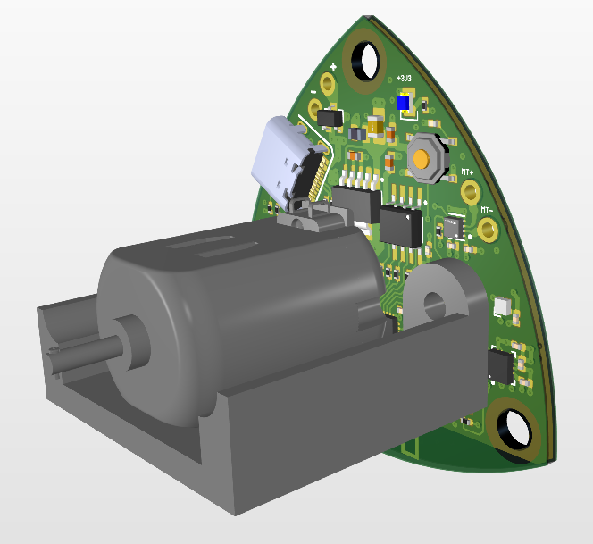
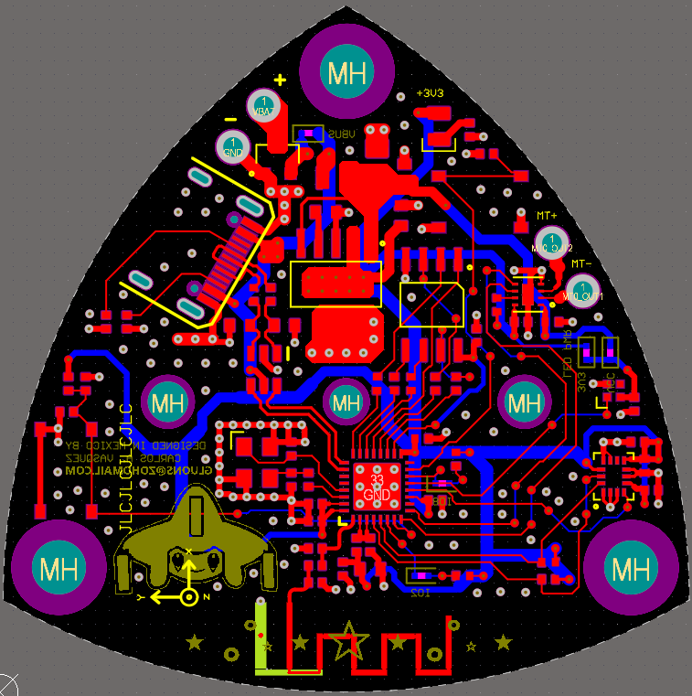
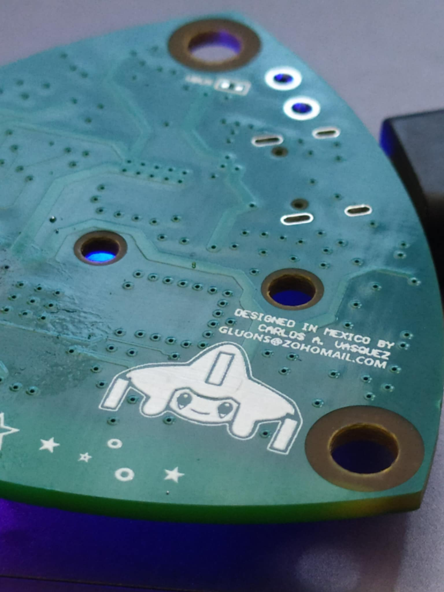
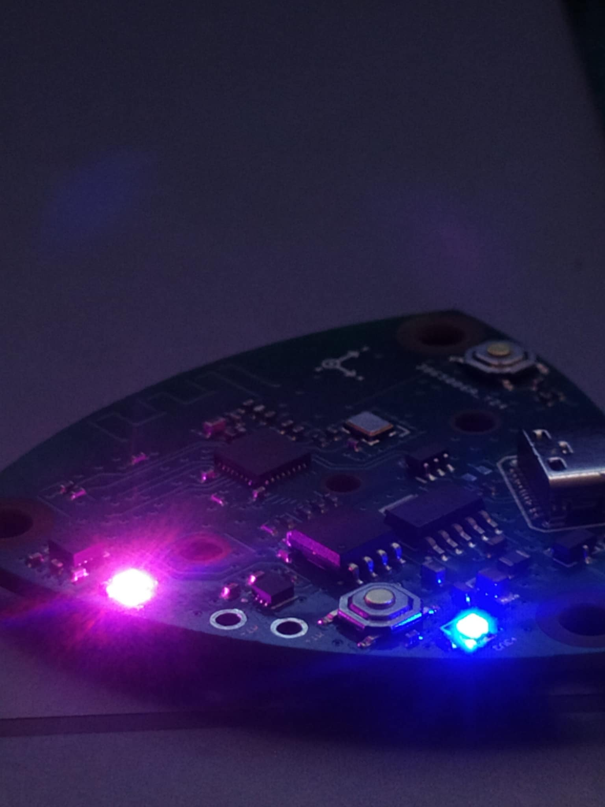
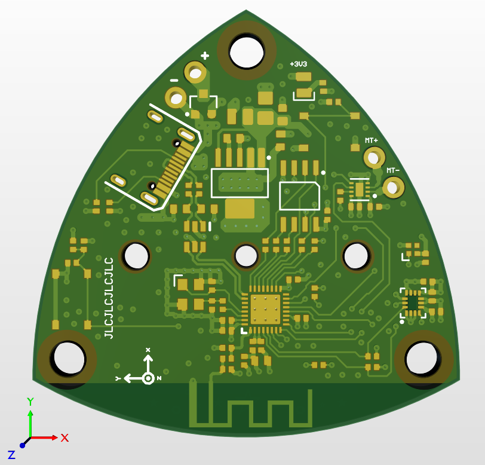
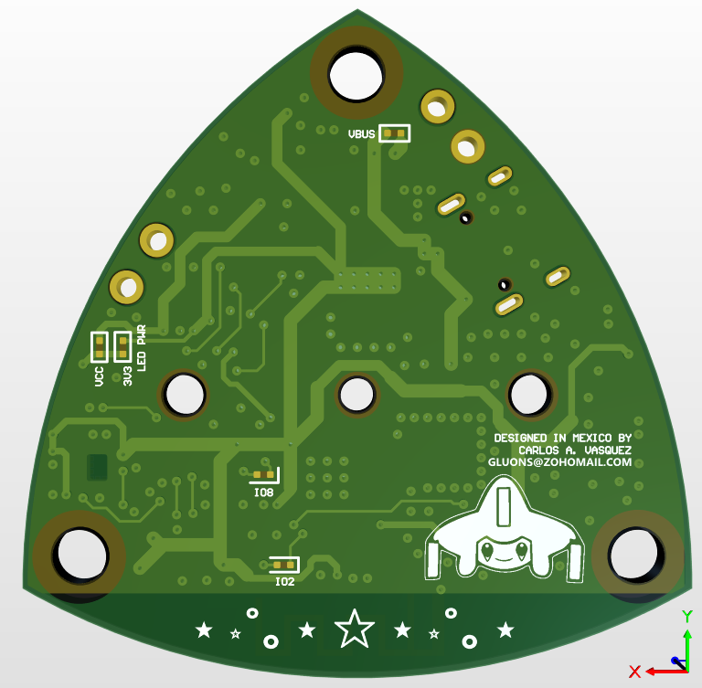

# Jirachi Hardware

The hardware for the Jirachi device is a custom designed PCB in the shape of a Reuleaux triangle. The original idea behind this design choice was to have two sets of PCBs sandwich an actuator, this way the PCB itself was designed to be the enclosure itself. Long story short, this original design didn't work [and you can read more about it over here.](../mechanical/README.md#original-design) Over all the mechanical features of the PCB didn't interfere with functionality so it stayed as it was originally planned.

The project was called `Lucido` before I decided to call it `Jirachi`, so that's why the hardware files have different filenames instead of the repository's name.

## Techincal Details

The PCB is a 4-layer board in the shape of a Reuleaux triangle. This special shape is known as a constant-width solid. The maximum width of the PCB is 50mm (you already know this size was intentional due to the discount over at JLCPCB for 4-layer boards nyehehehe, i'm poor like that :P). Here's the breakdown:

- 4-layer PCB: top and bottom layers used for signal and power routing, inner layers used exclusively as ground planes for optimal EMI and EMC.
- 50 mm max width.
- [ESP32-C3](https://www.espressif.com/sites/default/files/documentation/esp32-c3_datasheet_en.pdf): pretty cheap and powerful, able to run control algorithms smoothly, controlled through Bluetooh Low Energy.
- USB-C: This board uses the native USB/JTAG controller to program, debug and power the device. There's no fancy USB-C power delivery or anything like that, but I prefer using it over the more traditional type B and A because the current limit is a little higher ~1A.
- [W25Q128JVSIQ](https://www.winbond.com/resource-files/w25q128jv%20revf%2003272018%20plus.pdf) 128Mbit QSPI Flash.
- [TPS73733DCQR](https://www.ti.com/lit/ds/symlink/tps737.pdf) 1A low-dropout voltage regulator: this thing is a beauty thanks to the super low-dropout voltage and the max current draw available. With this IC, it was a no-brainer having the board being powered by USB or by an external single cell lithium battery.
- [ICM-42688-P](https://product.tdk.com/system/files/dam/doc/product/sensor/mortion-inertial/imu/data_sheet/ds-000347-icm-42688-p-v1.6.pdf) intertial measurment unit: it has a 3-axis accelerometer and a 3-axis gyroscope, with this it is possible to implement attitude estimation through a sensor-fusion algorithm.
- [SK6805-EC15](https://cdn-shop.adafruit.com/product-files/4492/Datasheet.pdf): you already know we need some RGB in this mf. It's just a single RGB LED onboard, but it does more than enough to signal the different states of the device.
- [DRV8837DSGR](https://www.ti.com/lit/ds/symlink/drv8838.pdf?ts=1737923637450): motor driver up to 1.8 A!! It's crazy how this IC being so small can handle almost 2 A. It's controller through two independent PWM channels and the motor is connected directly to the board's main input power source.
- Embedded PCB antenna: implemented from this [TI's Application Note](https://www.ti.com/lit/an/swra117d/swra117d.pdf). This antenna is designed to be resonant @ 2.4 GHz, used for the BLE (and maybe also Wi-Fi if i'm not too lazy) connectivity.

## Ordering the device

The gerber files are available inside the `Project Outputs for Lucido` directory. You can just drop the `LUCIDO_GERBER.zip` file into your favorite PCB manufacturer website. The `LUCIDO_BOM.csv` and `LUCIDO_CPL.csv` are the BOM and component placement files respectively, but they are tailored to work with JLCPCB's assembly service specifically.

## Pretty Pictures

## Known Issues
- NONE this is a perfect PCB!!!
- Forgot to add vias underneath the motor driver IC lol. I have other designs with this same IC that do have them, I just did this in one night and totally forgot to add this thermal via lmfao. It doesn't overheat really thanks to the huge copper mass in L2 and L3, but the thermals could be better for this board revision...