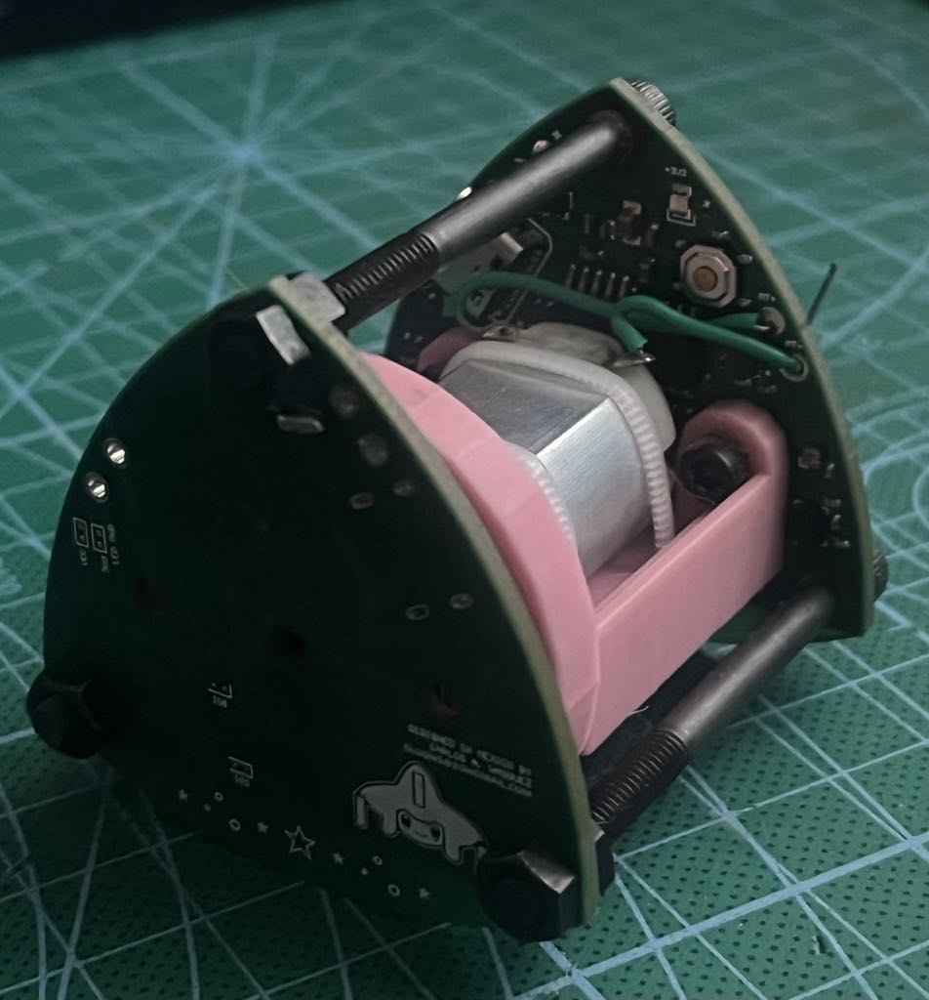

# Jirachi Mechanical Design
The mechanical design for the Jirachi device encloses the PCB in such a way that it extends the shape of the PCB, modifying its mechanical properties so that the control of the device is more stable.

It is currently being worked on so that's about it :P

## Original Design
The original design was implemented by trying to have the PCBs themselves be the mechanical feature that was in constant control. The following gif visualizes the original concept:

As you can see, the idea was to have a PCB on one side and another on the other side, sandwiching the motor and the flywheel for the active controller to change the angular momentum of the device in such a way that it could balance itself in one of the three unstable points of the shape (the 3 vertices of the triangle). This ideally works, however after testing and after trying to tune the PID controller, it was noted that the system was really unstable due to the distribution of the moments of intertia, mass, etc.

This is analog to trying to balance a pencil in the tip of your fingers vs. trying to balance a broom in the palm of your hand. The pencil requires a way more responsive controller than the broom. In fact due to how the moments of intertia and mass are distributed on the broom, it is really easy to balance it with minimal input from your hand.

Here are some pics from the original assembly!!

